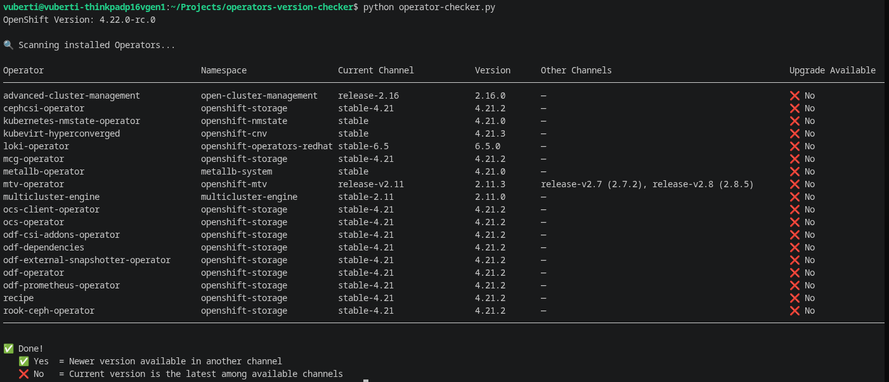

# OpenShift Operator Channel Checker

A Python script that scans all installed Operators in an OpenShift cluster and shows whether a **newer version** is available in another channel.

It helps you quickly identify operators that can be upgraded by switching channels.

## Features

- Lists all installed Operators (Subscriptions)
- Shows current channel and current version
- Displays other available channels with their versions
- Detects if a **newer version** is available in any other channel
- Clean, well-aligned terminal table output
- Supports both `oc login` and in-cluster execution
- Handles self-signed certificates (common in OpenShift)

## Requirements

- Python 3.8+
- `kubernetes` and `packaging` libraries

```bash
pip install kubernetes packaging
```

## Usage
```bash
python operator-checker.py
```

## Use a custom kubeconfig file:
```bash
python operator-checker.py --kubeconfig ~/.kube/config-prod
```

## Json output
```bash
python operator-checker.py --output json
```




